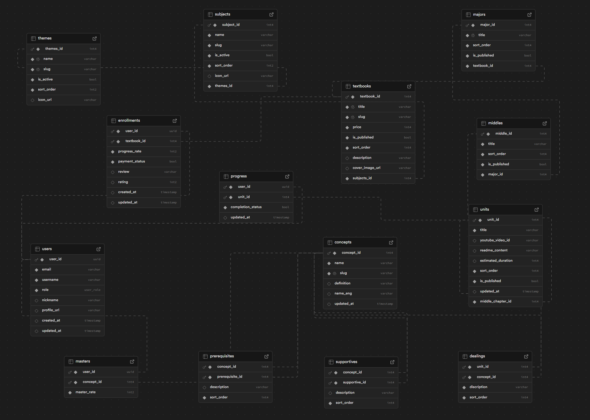

# 🚀 SejongClass: Code Your Life with Math & Physics

## 💡 코드로 배우는 수학, 물리, 그리고 인생공략 알고리즘



# ✅ Data Model Planning Worksheet


## [🔗 ERD Cloud Diagram Link](https://www.erdcloud.com/d/xhrSRC3koR8MXMipv)


**전통적인 종이와 연필 학습을 넘어서, Python 코드와 시각화를 통해 수학과 물리를 체험하는 혁신적인 학습 플랫폼입니다.**

---

## 🎯 왜 SejongClass인가요?

### 📚 **기존 학습의 한계**
- 추상적인 개념을 구체적으로 이해하기 어려움
- 단계별 연결성 부족으로 인한 학습 격차 발생
- 수동적 암기 위주의 학습 방식

### ⚡ **SejongClass의 해결책**
- **시각적 체험**: GeoGebra, Python 시각화로 개념을 눈으로 확인
- **체계적 연결**: 초등수학부터 고급물리까지 하나의 맥락으로 연결
- **능동적 탐구**: 코드를 직접 실행하며 "실험→시각화→이해"의 학습 사이클

---

## 🛤️ 학습 여정 로드맵

```
graph LR
    A[🔷 초등수학<br/>GeoGebra + Python 기초] --> B[🔷 중등수학<br/>Colab + 함수 그래프]
    B --> C[🔷 고등수학<br/>3D 플롯 + 모델링]
    C --> D[🔷 대학수학<br/>NumPy + SymPy]
    D --> E[🔶 기초물리<br/>애니메이션 + 시뮬레이션]
    E --> F[🔶 일반물리<br/>수치해석 + 3D 시각화]
    F --> G[🔶 고급물리<br/>양자역학 + 상대성이론]
    G --> H[🔶 예술물리<br/>p5.js + Processing]
```


---

## ✨ 핵심 특징

### 🎮 **인터랙티브 학습**
- 브라우저에서 바로 실행되는 Python 코드 환경
- 실시간 매개변수 조정으로 수식의 변화 관찰
- 물리 법칙을 직접 시뮬레이션하며 체험

### 🎨 **코드 + 예술의 융합**
- 수학 공식으로 아름다운 패턴 생성
- 물리 법칙 기반 디지털 아트 창작
- 개인 포트폴리오 구축 및 커뮤니티 전시

### 📊 **개인화된 학습 관리**
- AI 기반 취약점 자동 감지
- 개인별 맞춤 학습 경로 제안
- 실시간 진도 추적 및 목표 달성률 모니터링

### 🤝 **커뮤니티 기반 성장**
- 학습자 간 질문/답변 및 경험 공유
- 스터디 그룹 및 프로젝트 협업
- 멘토링 제공/수혜의 선순환 생태계

---

## 💰 가격 정책

| 학습 단계                       | 접근 권한     | 가격          |
|-----------------------------|-----------|-------------|
| 🔷 초·중·고 수학                 | **완전 무료** | 0원          |
| 🔶 기초 물리                    | **완전 무료** | 0원          |
| 🔷 대학수학 (미적분, 선형대수 등)       | 과목별 개별 구매 | 100,000원/과목 |
| 🔶 일반·고급 물리                 | 과목별 개별 구매 | 100,000원/과목 |
| 🔶 예술물리 (p5.js, Processing) | 과목별 개별 구매 | 100,000원/과목 |

---

## 🎯 누구를 위한 플랫폼인가요?

### 👦 **초·중·고 학생**
- 수학 개념을 놓쳐서 학습에 어려움을 겪는 학생
- 시각적이고 체험적인 학습을 선호하는 학생

### 🎓 **대학생 & 성인 학습자**
- 수학/물리를 다시 공부하고 싶지만 시작점을 모르는 분
- 코딩과 수학을 함께 배우고 싶은 분
- 창의적인 디지털 아트에 관심 있는 분

### 🧑‍🎨 **크리에이터**
- 수학과 물리학 기반의 생성예술 작품을 만들고 싶은 분
- 과학적 원리를 시각적으로 표현하고 싶은 분

---

## 🚀 시작하기

### 1. **무료 체험**
```
홈페이지 방문 → 회원가입 → 초등수학 샘플 레슨 체험
```


### 2. **본격 학습**
```
관심 과목 선택 → 단계별 학습 시작 → 코드 실습 → 시각화 확인
```


### 3. **커뮤니티 참여**
```
학습 경험 공유 → 질문/답변 → 스터디 그룹 참여 → 작품 전시
```


---

## 🌟 SejongClass가 제시하는 미래

> **"코딩은 앞으로 수학·물리 학습의 공용 언어가 될 것이다"**

SejongClass는 단순한 온라인 강의 플랫폼을 넘어서, **수학·물리·코딩을 통해 '생각하는 힘'을 훈련하는 글로벌 러닝 플랫폼**으로 발전할 것입니다.

AI가 대체할 수 없는 창의적 사고력과 문제해결 능력을 기르며, 학습 자체를 즐거운 취미로 만들어나가는 새로운 교육의 패러다임을 제시합니다.

---

## 📞 Contact & Links

- 🌐 **웹사이트**: [sejongclass.kr](https://sejongclass.kr) *(개발 중)*
- 📺 **유튜브**: 학습 콘텐츠 및 플랫폼 소개 영상
- 💻 **GitHub**: 오픈소스 프로젝트 기여 및 협업
- 📧 **이메일**: lifedesigner88@gmai.com

---

**🎓 지금 시작하세요! 수학과 물리가 이렇게 재미있을 줄 몰랐을 거예요.**

---

*SejongClass는 세종대왕의 창제정신을 계승하여, 누구나 쉽게 배울 수 있는 과학 교육 플랫폼을 만들어갑니다.*


---

## 🛠️ 기술 스택 (Tech Stack)

### **Frontend**
- **React 19.1.0** - 최신 React로 구성된 사용자 인터페이스
- **React Router 7.7.1** - 단일 페이지 애플리케이션 라우팅
- **TypeScript 5.8.3** - 타입 안정성을 위한 정적 타입 언어
- **Tailwind CSS 4.1.4** - 유틸리티 퍼스트 CSS 프레임워크
- **Framer Motion 12.23.12** - 애니메이션 및 인터랙션

### **UI Components & Design System**
- **Radix UI** - 접근 가능하고 고품질의 UI 컴포넌트
- Dialog, Tabs, Tooltip, Progress, Checkbox, Avatar 등
- **shadcn/ui** - 재사용 가능한 컴포넌트 시스템
- **Lucide React** - 아름다운 아이콘 라이브러리
- **React Icons** - 다양한 아이콘 컬렉션

### **Code Editor & Mathematical Tools**
- **Monaco Editor 4.7.0** - VS Code와 동일한 코드 에디터
- **KaTeX 0.16.22** - 빠른 수학 공식 렌더링
- **React Markdown 10.1.0** - 마크다운 콘텐츠 렌더링
- **Rehype & Remark** - 마크다운 처리 및 플러그인 생태계

### **Backend & Database**
- **Supabase** - Backend-as-a-Service (인증, 데이터베이스, 실시간 기능)
- **Drizzle ORM** - TypeScript 기반 SQL ORM
- **PostgreSQL** - Supabase를 통한 관계형 데이터베이스
- **Zod** - 런타임 타입 검증 및 스키마 정의

### **Development & Build Tools**
- **Vite 7.1.3** - 빠른 개발 서버 및 번들러
- **TSX** - TypeScript 실행 환경
- **npm** - 패키지 매니저
- **Drizzle Kit** - 데이터베이스 마이그레이션 도구

### **User Experience**
- **React Resizable Panels** - 사용자 정의 가능한 레이아웃
- **Embla Carousel** - 터치 친화적 캐러셀 컴포넌트
- **JWT Decode** - 사용자 인증 토큰 처리
- **Isbot** - 봇 감지 및 보안

### **Environment & Configuration**
- **dotenv** - 환경 변수 관리
- **Tailwind Animate CSS** - 고급 CSS 애니메이션
- **Class Variance Authority** - 조건부 스타일링 유틸리티

---

### **🎯 선택 이유**

**⚡ 성능 최적화**
- Vite + React 19로 빠른 개발 경험 및 최적화된 프로덕션 빌드
- Supabase Edge Functions로 글로벌 CDN 활용

**🔒 타입 안전성**
- TypeScript + Zod로 컴파일 타임과 런타임 모두에서 타입 안전성 보장
- Drizzle ORM으로 데이터베이스 스키마의 타입 안전성 확보

**📱 사용자 경험**
- Radix UI로 웹 접근성 표준 준수
- Tailwind CSS로 반응형 디자인 및 일관된 디자인 시스템

**🚀 개발 생산성**
- React Router 7의 최신 파일 기반 라우팅
- shadcn/ui로 빠른 UI 컴포넌트 개발
- Supabase로 백엔드 개발 시간 단축

**🔧 확장성**
- 모듈화된 feature 기반 아키텍처
- Drizzle ORM으로 복잡한 데이터 관계 관리
- Monaco Editor로 브라우저 기반 코드 실행 환경 제공

이 기술 스택은 **교육 플랫폼의 요구사항**(실시간 코드 실행, 수학 공식 렌더링, 사용자 인터랙션)에 최적화되어 있으며, 빠른 개발과 안정적인 서비스 운영을 동시에 만족시킵니다.