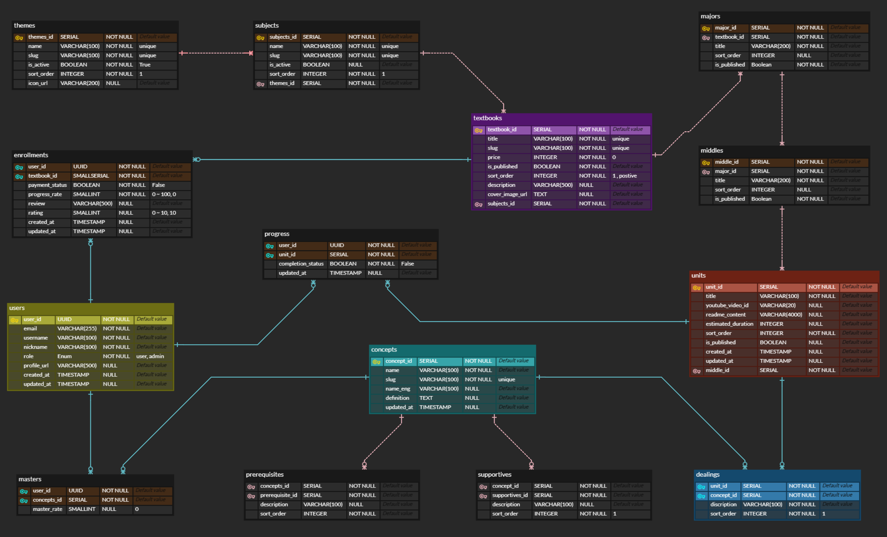

# ✅ SejongClass: Code Your Life with Math & Physics (코드로 배우는 수학, 물리, 그리고 인생공략 알고리즘)

## 아이디어 기본 사항
- **생각 중인 제품/스타트업 이름(있다면)**: - *SejongClass: Code Your Life with Math & Physics*
- **제품 아이디어에 대한 한 문장 설명**: - *코드로 배우는 수학, 물리, 그리고 인생공략 알고리즘*
- **이 아이디어를 얼마나 오래 생각해왔나요?**: - *3년정도*
- **이미 작업을 시작했다면 어느 정도 진행되었나요?**: - *파일럿 교재 작성 및 기본 기능 구상 단계*

## 문제 및 해결책
1. **문제 진술**: - *현재 학습 방식은 여전히 강의와 종이와 연필을 통한 문제풀이 위주라서 개발과 같은 시각적, 체험적 학습 경험 부족*
2. **개인적 연결**: - *초,중,고 학생들을 직접 1:1로 가르치면서 수학 개념을 한 번 놓치면 평생 다시 배울 기회를 놓치는 사례를 자주 목격함*
3. **타겟 사용자**: - *① 초·중·고 학생 (기초 개념 학습) -> 학습 격차 예방, ② 대학생 (심화 학습의 기반), ③ 성인 학습자 (취미 & 자기개발)*
4. **현재 대안**: - *EBS & 유튜브 무료강좌, Khan Academy, 대학 교재 등*
5. **당신의 솔루션**: - *기존의 종이와 연필로 공부하던 방식에서 코드를 통해 공부하는 새로운 방식 도입*
6. **독특한 접근 방식**: - *일반 대중이 자연스럽게 인공지능과 시각화 라이브러리에 친숙해지면서 고급개념 접근 가능*

## 초기 검증 단계
1. **대화 경험**: - *수학, 물리, 코딩을 인공지능과 함께 한번에 배울 수 있다면 좋겠다는 의견이 있었음*
2. **비공식 조사**: - *개인적으로 수학, 물리의 어려운 개념들을 컴퓨터로 계산하고 풀어보고 싶은 욕구가 있음*
3. **초기 피드백**: - *수학, 물리, 코드를 통해 훈련된 추상화 능력은 삶의 문제를 풀어나가는데 큰 도움이 됨*
4. **가정들**: - *기존에 하던 일자리들은 대부분 인공지능에게 대체되고 학습 자체를 취미로 하는 인구가 늘것이다*
5. **검증 계획**: - *초,중,고 기초내용부터 종이와 연필 없이 코드만으로 공부할 수 있는 방법을 소개하고 반응 볼 계획 반응 적더라도 그 방식으로 대학수학, 물리과정들을 공부해 나아갈 예정*

## 시장에 대한 이해
1. **잠재 시장**: - *온라인 수학/물리 튜터링 시장은 연평균 14% 성장 중, 기본소득, 일자리 감소로 인해 취미가 학습인 사람들이 늘어날 전망*
2. **경쟁사**: - *Khan Academy, MooK, 인프런*
3. **차별화 요소**: - *단순 강의 전달이 아니라 코드를 직접 실행해 개념을 확인하는 상호작용형 학습 경험 제공, 신뢰있는 강사와 함께 성장하는 브랜드*
4. **초기 가격 전략**: - *초,중,고 콘텐츠는 무료, 대학수학(미적분, 선형대수, 확률통계, 이산수학)은 과목별 10만원 정도, 추후 물리, 화학, 생물, 알고리즘, 인생관 등등 확장.*

## 최소 기능 제품 (MVP)
1. **핵심 기능**: - *1차 : 코드 + 수식 변환 + 시각화, 2차 : AI 질문 답변, 영상, 교재”, 3차 : 개인별 학습상황 저장 및 및 커뮤니티 기능*
2. **성공 지표**: - *한번 접속한 유저들이 지속적으로 접속하여 공부를해 나아가는 활성화 유저수*
3. **유저 확보 계획**: - *유튜브 채널을 운영하여 홍보*
4. **타임라인**: - *6주 안에 기본기능을 만들고 그 이후로는 지속적으로 수학, 물리, 알고리즘등을 공부 하며 콘텐츠 업로드*

## 배경 & 동기
1. **배경**: - *수학 교육 경험, 코딩 공부 경험, 그리고 개인적으로 수학, 물리, 과학공부를 좋아함*
2. **보유 기술**: - *Windows 노트북, ReactRouter, SupaBase, shadcn*
3. **기술 격차**: - *아직 수학을 공부할 때 사용할 수 있는 라이브러리 등에 대한 지식이 부족, 웹 서비스 자체에 내장시키는 것은 어려울 것 같아서, 다양한 서비스들을 조합해서 수학, 물리를 공부하는 방법을 교육하는 방향으로 초기 방향을 정할 예정*
4. **지원 네트워크**: - *노마더 코더 동기분들, 그리고 인공지능과의 대화를 통해 해결해 나아갈 예정*
5. **도메인 지식**: - *초중고 수학개념에 대한 높은 이해도, 물리, 뇌과학, 종교, 독서등을 통해 얻은 다양한 분야의 지식들*
6. **동기**: - *이런 서비스가 있었으면 좋겠는데 없어서 직접 만들어야 겠다는 생각이 들었고 나와 관심사가 비슷한 사람들을 만나보고 싶은 생각도 있음, 이 서비스는 수학과 물리를 배움과 동시에 코딩 리터러시를 쌓을 수 있는, 기존에 없는 유일한 플랫폼을 목표로 함*
7. **아이디어의 기원**: - *SejongClass는 궁극적으로 수학·물리·코딩을 넘어서 인류가 배워야 할 ‘생각하는 힘’을 훈련하는 글로벌 러닝 플랫폼으로 확장할 수 있음.*

## 학습 & 성장 마인드셋
1. **프로젝트 경험**: - *6개월 부트캠프에서 지식관리 웹서비스를 Vue(Javascript), Spring(Java), MariaDB(SQL) 를 통해 배포해본 경험이 있음  *
2. **교훈 & 인사이트**: - *코딩은 앞으로 수학·물리 학습의 공용 언어가 될 것이다”*
3. **리소스**: - *지능의 기원 - 맥스 베넷 저 (인공지능을 개발하기 위해 인류의 지능의 기원을 추적하며 인간에 대한 이해가 점점 넓어지고 삶에 도움되는 통찰을 얻게 되는 책)*
4. **롤모델**: - *노마드 코더(니코) - 1인 강의를 꾸준히 하면서 스스로 성장해 나아가는 삶의 과정을 보면서, 나도 대중들의 지식수준을 한 단계 올리는데 기여하는 사람이 되고 싶다는 생각을 함*  

# ✅ JTBD

## SECTION 1: JOB DEFINITION & CONTEXT
1. **Progress-Making Statement**  
   *수학/물리 개념을 제대로 이해해야 하는 상황일 때, 내가 추상적인 개념을 구체적으로 체감하고 실제로 활용할 수 있도록 도와주세요.*
2. **Job Triggers**  
   *- 수학 공부 할 때 이전개념을 잊어버렸는데 뭘 모르는지 모르는 초,중,고,대학생들*
   *- 학교 졸업 후 수학/물리를 다시 공부하고 싶지만 어디서 시작해야 할지 막막할 때*
   *- 죽기전에 인류가 쌓아올린 지식의 정수의 맛을 보고 싶은데 함께할 동료들을 만나고 싶을 때*
3. **Job Stability**  
   *수 많은 교사들이 직관적이지 않지만 중요한 수학개념들을 이해시키기 위해 수 천년간 많은 노력들을 하고 있습니다. 기존에 사용하던 종이와 연필로는 한계가 있기에 컴퓨터와 AI를 사용해서 어려운 개념을 이해하는 방식을 제안하고 싶습니다.*
4. **Hiring Moment**  
   *수학, 물리를 공부하는 여러가지 툴들이 있지만 하나의 맥락으로 정리가 되어 있지 않아 진입장벽이 높은 현재 상황*
5. **Anxieties & Habits**  
   *- 수학/물리가 너무 어렵다는 기존 고정관념에 더 어려워 보이는 코딩까지 배우면 더 복잡해 질 수 있다는 두려움*
   *- 수학과 물리는 손으로 풀어야 제 맛이라는 기존의 고정관념*

## SECTION 2: JOB THEORY EXPLORATION
1. **Progress Definition**  
   *쉬운 초등학교 수학개념을 공부하면서 차츰 코드에 익숙해지고 코드에익숙해 질 때 쯤 어려운 수학개념을 배우고 어려운 수학개념이 익숙해지면 물리도 정복할 수 있겠다는 자신감을 느낄 때*
2. **Forces of Progress**  
   *손으로만 풀고 이해하는 공부방식은 대학교 1학년 수준의 개념에선 통하지만 그 이상으로 갈 수록 코드를 입력하고 디버깅을하는 방식이 아니면 벽을 만나 좌절하게 되기때문에 이 솔루션으로 해결 할 수 있음*
3. **Barriers to Consumption**  
   *코딩에 대한 진입장벽과, 두려움, 기존 학습법에 익숙해진 관성, 새로운 도구 사용에 대한 시간 투자 부담.*
4. **First-Thought Solutions**  
   *유튜브 무료강의나, 과외선생님, 또는 Kan Academy나 인프런 강의등*
5. **Unexpected Competitors**  
   *수학을 잘 가르치는 기존 1타 강사들*

## SECTION 3: SWITCHING BEHAVIOR
1. **Last-Straw Moments**  
   *어려운 수학개념이나 물리를 공부한다고 얻을 수 있는게 없다고 느낄때.*
2. **Active vs. Passive Looking**  
   *보통은 더 나은 솔루션을 찾다가 벽을 만나면 수동적으로 포기하게 되는 경우가 많은 것 같습니다.*
3. **Trade-Off Analysis**  
   *초등, 중등, 고등, 대학교, 심화 과정 모두 다른 선생님들이 알려주고 있어서 맥락이 붕괴된다는 점*
4. **Compensating Behaviors**  
   *결국 벽을 만나면 재미를 잃게되고 취미로서 가치가 사라지면 포기하게 되는 패턴이 반복됨*
5. **Hiring Criteria**  
   *어렵다고 생각한 개념이 사실은 그렇게 어렵지 않았다는걸 조금씩 알게되는 경험*

## SECTION 4: JOB DIMENSIONS & CONSTRAINTS

1. **Functional Job Aspects**  
   *웹 브라우저 내에서 파이썬 코드를 활용해서 공부할 수 있어야 함. 코드에 익숙해지면 추후 심화에서 VSCode 같은 외부 IDE 설치 과정 제안*
2. **Emotional Job Aspects**  
   *느끼고 싶은 감정 : 생각보다 쉽고 재미있네? , 피하고 싶은 감정 : 역시 어럽고 삶에 도움이 안된다는 느낌*
3. **Social Job Aspects**  
   *수학/물리를 이해한 인간이라는 느낌, 최신 학습법을 익혔다는 앞선 느낌*
4. **Constraints & Limitations**  
   *학습에는 시간이 들어가는데, 시간을 투자할 만한 재미를 느낄 수 있도록 게임적인 요소 도입*
5. **Desired Outcomes**  
   *대부분 일반인들이 접근하지 못하는 어려운 수학/물리 개념을 공부하는 살람 수가 늘어날 경우.*

## SECTION 5: COMPETING SOLUTIONS ANALYSIS
1. **DIY Solutions**  
   *대부분 포기, 수학/물리는 자연의 본질인데 대부분 공부 하지 않음.*
2. **Solution Evolution**  
   *칠판 -> 파워포인트 -> 온라인강의 -> 시각적인 인터랙티브 툴 로 진화중*
3. **Surprising Alternatives**  
   *수학 공부를 도와주는 여러 툴들이 생기고 있는데 각 툴마다 학습장벽이 높은편*
4. **Non-Consumption Analysis**  
   *순수학문은 호기심을 충족시켜주는 즐거움을 보상으로 해야 하는데, 그 즐거움을 여러 이유로 잃게되면 안하게됨 *
5. **Solution Compromises**  
   *본질적인 수학개념을 공부하는 시간보다 그 개념을 공부하기위한 툴을 익히는데 더 많은 시간이 듬*

## SECTION 6: PROGRESS-FOCUSED INNOVATION

1. **Progress Accelerators**  
   *초등수학부터 고급개념까지 파이썬이라는 하나의 툴로 공부하며 자연스럽게 툴을 체화하하여 학습에 가속화가 이루어짐*
2. **Anxiety Reducers**  
   *높은 탑에서 하위 지지대가 불안하면 높이 쌓을 수 없듯이 수학공부하다가 예전 개념을 잊어버려 공부를 포기하는 경우가 있는데 이전 개념을 쉽게 찾을 수 있도록 해줌으로써 더 멀리 갈 수 있게 해줌*
3. **Habit Fighters**  
   *기존의 "암기→문제풀이" 패턴을 "실험→시각화→이해" 패턴으로 전환하여, 수동적 학습 습관을 능동적 탐구 습관으로 바꿉니다.*
4. **Job Story**  
   *수학/물리 개념을 배워야 하는 상황일 때, 나는 진정한 이해를 통한 자신감을 얻고 싶기 때문에 개념이 직관적으로 체감되는 학습 경험을 이루고 싶다*
5. **Job Measurement**  
   *지속적인 학습 참여도 및 완주율 측정, 수학/물리에 대한 태도의 변화 (두려움 -> 호기심) 측정*

# ✅ System Footprint & URL Map Worksheet

## 1. 주요 흐름 (Key Flows)

**📚 단계별 학습 여정**: 
- 초등수학(GeoGebra) → 중등수학(Colab) → 고등수학(고급시각화) → 대학수학(NumPy/SymPy) → 물리학(기초→일반→고급) → 예술물리(p5.js/Processing)로 이어지는 체계적 커리큘럼 완주

**💻 코드-수학-물리 통합 실습**: 
- 이론 학습 → Python 코드 작성 → 시각화 결과 확인 → 물리 법칙 검증 → 인터랙티브 시뮬레이션 구현의 반복적 학습 사이클

**🎨 창작자로의 성장 여정**: 
- 기초 개념 습득 → 복잡한 시뮬레이션 구현 → 물리 법칙 기반 예술 작품 창작 → 개인 포트폴리오 구축 → 커뮤니티 전시 및 피드백

**🤝 커뮤니티 기반 협력 학습**: 
- 개인 학습 → 질문 게시 및 답변 → 스터디 그룹 참여 → 프로젝트 협업 → 멘토링 제공/수혜의 선순환 생태계 참여

 **📊 개인화된 학습 최적화**: 
- 대시보드에서 학습 현황 분석 → 취약점 자동 감지 → AI 맞춤 추천 → 목표 설정 및 달성 → 수료증 획득 및 경력 연동의 데이터 기반 성장 관리

## 2. 사용자가 방문할 URL/페이지
*주요 페이지의 URL과 해당 페이지의 목적, 접근 권한을 정리하세요*

| Page Name   | URL Path             | Purpose (페이지 목적)                     | Access Level (접근 권한) |
|-------------|----------------------|--------------------------------------|----------------------|
| 🚀 Home     | `/`                  | 플랫폼 소개, 학습 여정 개요, 가입 유도              | 모든 방문자               |
| 🔷 초등수학     | `/elementary/:id `   | 기초 수학 개념 + Python 기초 + geogebra      | 무료                   |
| 🔷 중등수학     | `/middle-school/:id` | 중등 수학 개념 + colab                     | 무료                   |
| 🔷 고등수학     | `/high-school/:id`   | 고등 수학 개념 + 고급 시각화                    | 무료                   |
| 🔷 대학수학     | `/university/:id`    | 미적분, 선형대수, 확률통계, 이산수학                | 유료 (과목별 10만원)        |
| 🔶 기초물리     | `/physics/basic/:id` | 운동과 힘, 에너지와 일, 파동과 소리, 빛과 색          | 무료                   |
| 🔶 일반물리     | `/physics/plus/:id`  | 역학, 열역학, 전자기, 파동 광학                  | 유료 (과목별 10만원)        |                             
| 🔶 고급물리     | `/physics/pro/:id`   | 양자역학, 상대성이론, 통계물리, 현대물리              | 유료 (과목별 10만원)        |
| 🔶 예술물리     | `/physics/art/:id`   | p5.js (javascript), Processing(Java) | 유료 (과목별 10만원)        |
| ☑️️ 학습 대시보드 | `/dashboard`         | 개인 학습 진도, 완료한 과정 관리                  | 가입 사용자               |
| 🧑‍ 커뮤니티    | `/community`         | 학습자 간 토론, 경험 공유                      | 가입 사용자               |

## 3. 각 페이지에서 가능한 사용자 행동

### 🚀 Home (`/`)
- 플랫폼 소개 영상 시청 및 학습 여정 로드맵 확인
- 무료 체험하기 (초등수학/기초물리 샘플 레슨 바로 시작)
- 회원가입/로그인 (소셜 로그인: Google, GitHub)
- 유튜브 채널 이동 및 블로그 링크 탐색
- 가격정책 확인 및 유료 과정 미리보기

### 🔷 초등수학 (`/elementary/:id`)
- GeoGebra 통합 인터랙티브 수학 시각화 체험
- Python 기초 문법을 수학 문제와 연결하여 학습
- 단계별 퀴즈 풀이 및 즉시 피드백 받기
- 간단한 계산 코드 작성 및 실행 (덧셈, 뺄셈 시각화)
- 다음 단계(중등수학)로 자동 진행 또는 수동 이동

### 🔷 중등수학 (`/middle-school/:id`)
- Google Colab 연동으로 클라우드에서 코드 실행
- 함수 그래프 그리기 및 실시간 매개변수 조정
- 대수, 기하 개념을 Python 시각화로 확인
- 개념 이해도 자가 테스트 및 취약점 분석
- 고등수학 과정 예고편 시청

### 🔷 고등수학 (`/high-school/:id`)
- 복잡한 그래프 및 3D 플롯 생성 (삼각함수, 지수로그)
- 수학적 모델링 실습 (실생활 문제 해결)
- 대학수학 연결 개념 미리보기
- 유료 과정 구매 결정을 위한 무료 샘플 체험
- 학습 노트 작성 및 개인 포트폴리오 구축

### 🔷 대학수학 (`/university/:id`)
- 과목별 개별 구매 (미적분 10만원, 선형대수 10만원 등)
- 고급 수학 개념의 엄밀한 증명과 코드 구현 병행
- 복잡한 시각화 라이브러리 활용 (NumPy, SciPy, SymPy)
- 과제 제출 시스템을 통한 개인 피드백 수령
- 수학 개념을 물리학으로 확장하는 브릿지 코스 안내

### 🔶 기초물리 (`/physics/basic/:id`)
- 일상 속 물리 현상을 Python 애니메이션으로 시각화
- 운동 법칙, 에너지 보존을 인터랙티브하게 탐험
- 파동과 소리를 실제 코드로 생성하고 듣기
- 빛과 색상의 스펙트럼을 RGB 조합으로 실험
- 물리 실험실 시뮬레이터 체험

### 🔶 일반물리 (`/physics/plus/:id`)
- 복잡한 물리 방정식을 수치해석으로 해결
- 전기장/자기장 벡터 필드 3D 시각화
- 열역학 시뮬레이션 (기체 분자운동, 엔트로피)
- 파동 간섭/회절 패턴 실시간 생성
- 물리 상수 조정을 통한 가상 우주 실험

### 🔶 고급물리 (`/physics/pro/:id`)
- 양자역학 파동함수 시각화 및 확률 계산
- 상대성이론 시공간 다이어그램 구현
- 몬테카르로 방법으로 통계물리 시뮬레이션
- 입자물리학 표준모형 시각화
- 고급 수치해석 기법 습득

### 🔶 예술물리 (`/physics/art/:id`)
- p5.js로 물리 법칙 기반 인터랙티브 아트 창작
- Processing으로 생성예술 작품 제작
- 프랙털, 파동간섭을 활용한 시각적 패턴 생성
- 개인 작품 갤러리 구축 및 커뮤니티 공유
- 물리학자에서 디지털 아티스트로의 전환 가이드

### ☑️ 학습 대시보드 (`/dashboard`)
- 전체 학습 진도율 및 완료 과정 한눈에 보기
- 다른 회원들의 진도상황 모니터링
- 취약한 개념 자동 감지 및 보완 학습 추천
- 학습 목표 설정 및 달성률 추적
- 수료증 다운로드 

### 🧑 커뮤니티 (`/community`)
- 학습 경험 블로그 포스팅 (마크다운 에디터 지원)
- 물리/수학 관련 질문 게시 및 답글 
- 스터디 그룹 개설/참여
- 개인 프로젝트 및 아트 작품 전시
- 멘토링 요청 및 다른 학습자 도움

## 4. 사용자 역할 및 권한

- **비회원 방문자**: 홈페이지 탐색, 소개 영상 시청, 무료 샘플 레슨 1회 체험, 커뮤니티 읽기 전용
- **무료 회원**: 초중고 수학/기초물리 전체 접근, 기본 대시보드 이용, 커뮤니티 글 작성/댓글, 제한적 질문 게시 (월 3회)
- **유료 회원 (단일 과목)**: 구매한 과목만 접근, 해당 과목 과제 제출, AI 질문답변 제한적 이용, 개인 학습 분석
- **관리자**: 모든 콘텐츠 CRUD, 사용자 관리, 결제 및 환불 처리, 학습 데이터 분석 대시보드, 시스템 설정 변경

## 5. 엣지 케이스 및 오류 처리

- **Pyodide 로딩 실패**: 로딩 상태 표시 → 재시도 버튼 → 대체 서버 자동 연결 → 최종 실패 시 외부 클라우드 IDE 사용 권장
- **코드 실행 무한루프**: 5초 타임아웃 설정 → 경고 메시지 후 강제 중단 → 사용자 로그를 통한 블랙리스트 파악
- **브라우저 호환성 이슈**: 최신 브라우저 크롬 업데이트 권장  
- **결제 시스템 오류**: 결제 중단 시 임시 저장 → 관리자 연락할 수 있는 채널 안내 → 24시간 내 해결 보장
- **학습 데이터 손실**: 학습 진도 데이터 손실 → 매일 학습 진도관련 DB 백업 → 24시간 내에 데이터 복구 보장  
- **부적절한 커뮤니티 활동**: 사용자 신고 시스템 → 3단계 경고 제도 → 영구 정지 시 환불 정책 적용

# ✅ Data Model Planning Worksheet

## [🔗 ERD Cloud Diagram Link](https://www.erdcloud.com/d/xhrSRC3koR8MXMipv)

## 1. 시스템의 핵심 엔터티(Entities)는 무엇인가요?

- **Users** - 시스템을 사용하는 사용자들 (학습자, 관리자 등)
- **Textbooks** - 교재/교과서 (학습 콘텐츠의 최상위 단위)
- **Units** - 학습 단위 (실제 학습이 이루어지는 최소 단위)
- **Concepts** - 학습 개념 (지식의 기본 단위)
- **Progress** - 학습 진도 (사용자의 학습 상태 추적)

---

## 2. 각 엔터티의 필드를 정의하세요:

**[Users]**
- `user_id` (UUID) - Primary Key
- `email` (VARCHAR(255)) - Unique, Not Null
- `username` (VARCHAR(100)) - Not Null
- `password_hash` (VARCHAR(255)) - Not Null
- `role` (VARCHAR(20)) - Not Null
- `profile_image_url` (TEXT) - Optional
- `created_at` (TIMESTAMP)
- `updated_at` (TIMESTAMP)

**[Textbooks]**
- `textbook_id` (SMALLSERIAL) - Primary Key
- `title` (VARCHAR(200)) - Not Null
- `slug` (VARCHAR(200)) - Unique, Not Null
- `description` (TEXT) - Optional
- `grade_level` (VARCHAR(50)) - Optional
- `semester` (VARCHAR(10)) - Optional
- `price` (INTEGER) - Default 0
- `cover_image_url` (TEXT) - Optional
- `is_published` (BOOLEAN) - Default False
- `sort_order` (INTEGER) - Not Null
- `subjects_id` (SMALLINT) - Foreign Key

**[Units]**
- `unit_id` (SERIAL) - Primary Key
- `title` (VARCHAR(300)) - Not Null
- `slug` (VARCHAR(300)) - Unique, Not Null
- `youtube_video_id` (VARCHAR(20)) - Optional
- `readme_content` (TEXT) - Optional
- `estimated_duration` (INTEGER) - Minutes
- `sort_order` (INTEGER) - Not Null
- `is_published` (BOOLEAN) - Default False
- `middle_chapter_id` (SMALLINT) - Foreign Key

**[Concepts]**
- `concept_id` (SERIAL) - Primary Key
- `name` (VARCHAR(200)) - Not Null
- `slug` (VARCHAR(200)) - Unique, Not Null
- `description` (TEXT) - Optional
- `definition` (TEXT) - Optional
- `difficulty_level` (INTEGER) - 1-10 scale
- `tags` (JSONB) - Default '{}'
- `created_at` (TIMESTAMP)
- `updated_at` (TIMESTAMP)

**[Progress]**
- `user_id` (UUID) - Foreign Key, Composite Primary Key
- `units_id` (INTEGER) - Foreign Key, Composite Primary Key
- `completion_status` (BOOLEAN) - Default False
- `completion_percentage` (INTEGER) - 0-100
- `notes` (TEXT) - Optional
- `created_at` (TIMESTAMP)
- `updated_at` (TIMESTAMP)

---

## 3. 어떤 관계들이 존재하나요?

- **Themes (1) ↔ Subjects (N)** - 하나의 테마는 여러 과목을 가질 수 있음
- **Subjects (1) ↔ Textbooks (N)** - 하나의 과목은 여러 교재를 가질 수 있음
- **Textbooks (1) ↔ Major Chapters (N)** - 교재는 여러 대단원을 포함
- **Major Chapters (1) ↔ Middle Chapters (N)** - 대단원은 여러 중단원을 포함
- **Middle Chapters (1) ↔ Units (N)** - 중단원은 여러 학습 단위를 포함
- **Users (N) ↔ Textbooks (N)** - 다대다 관계 (user_textbook_enrollments를 통해)
- **Users (N) ↔ Units (N)** - 다대다 관계 (progress를 통해)
- **Users (N) ↔ Concepts (N)** - 다대다 관계 (user_concepts를 통해)
- **Units (N) ↔ Concepts (N)** - 다대다 관계 (unit_concepts를 통해)
- **Concepts (N) ↔ Concepts (N)** - 자기참조 관계 (prerequisites, supportives)

---

## 4. 어떤 CRUD 작업이 필요한가요?
*각 엔터티에 대해 Create, Read, Update, Delete 중 어떤 작업이 필요한지, 그리고 누가 수행할 수 있는지를 정의하세요.*

| Entity    | Create             | Read                | Update             | Delete           |
|-----------|--------------------|---------------------|--------------------|------------------|
| Users     | 회원가입시 (본인)         | 프로필조회 (본인, 관리자)     | 프로필수정 (본인, 관리자)    | 회원탈퇴 (본인, 관리자)   |
| Textbooks | 콘텐츠 생성 (관리자, 강사)   | 교재 목록/상세 (모든 사용자)   | 교재 정보 수정 (관리자, 강사) | 교재 삭제 (관리자)      |
| Units     | 학습 단위 생성 (관리자, 강사) | 학습 내용 조회 (수강생, 관리자) | 학습 내용 수정 (관리자, 강사) | 학습 단위 삭제 (관리자)   |
| Concepts  | 개념 생성 (관리자, 강사)    | 개념 조회 (모든 사용자)      | 개념 수정 (관리자, 강사)    | 개념 삭제 (관리자)      |
| Progress  | 학습 시작시 (본인)        | 진도 조회 (본인, 관리자)     | 진도 업데이트 (본인)       | 진도 초기화 (본인, 관리자) |

---

## 5. 어떤 규칙이나 제약이 존재하나요?

- **사용자 관련**
   - 이메일은 유니크해야 하며 유효한 이메일 형식이어야 함
   - 사용자명은 중복될 수 없으며 특수문자 제한
   - 비밀번호는 해시화하여 저장

- **교재/학습 구조 관련**
   - 교재는 발행(is_published)된 것만 수강 가능
   - 학습 단위의 정렬 순서(sort_order)는 중복될 수 없음
   - 상위 챕터가 삭제되면 하위 챕터/단위도 함께 삭제

- **진도 관리 관련**
   - 진도율(completion_percentage)은 0-100 사이의 값
   - 사용자는 수강 등록된 교재의 단위만 학습 가능
   - 완료 상태(completion_status)가 true면 completion_percentage는 100이어야 함

- **개념 관리 관련**
   - 선수 개념(prerequisites)에 순환 참조가 발생하면 안됨
   - 난이도 레벨(difficulty_level)은 1-10 사이의 값
   - 개념의 마스터율(master_rate)은 0-100 사이의 값

- **수강 등록 관련**
   - 유료 교재는 결제 완료 후 접근 가능
   - 수강 기간(access_expires_at) 만료 시 접근 제한
   - 리뷰와 평점은 수강 등록된 사용자만 작성 가능